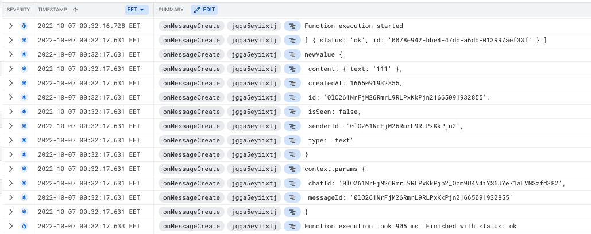

<h1>PATIKA REACT NATIVE GRADUATION PROJECT</h1>
This is a project for Patika.dev React Native Bootcamp. It is a messaging app that uses Firebase for authentication, storage, database and cloud functions.

<h2>Required Softwares</h2>

---

<li>Node 16</li>
<li>Yarn</li>
<li>Xcode</li>
<li>Android Studio</li>
<br/>

<h2>Installation</h2>

---

Clone the project

```bash
git clone
```

Go to the project directory

```bash
cd patika-react-native-graduation-project
```

Install dependencies

```bash
yarn
```

Start Metro

```bash
yarn start
```

Start the app

```bash
yarn android
yarn ios
```

<h2>Screenshots</h2>

<h3>Auth Stack</h3>

<div>
  
  
</div>

<h3>Contacts Page</h3>

https://user-images.githubusercontent.com/53280610/194757384-a7ff21a1-9143-4732-a6ad-ef2488903852.mov

<h3> Profile and Edit Profile Page</h3>

https://user-images.githubusercontent.com/53280610/194757409-c2dc7e4e-4ce0-482a-ae39-6fd65ccc8489.mov

<h3>Creating a Chat And Messaging</h3>

As you can see, when a user sends a message, the receiver will receive a notification.

https://user-images.githubusercontent.com/53280610/194760398-9790c8a0-8be5-4e5e-a20c-bcd30b0e0b9b.mov

<h3>Sending Live Location and Showing in a large MapView</h3>

https://user-images.githubusercontent.com/53280610/194760924-a0bea33d-81ae-486b-843b-94b5e22ef2dc.mov

<h3>Choosing an Image From Library</h3>

https://user-images.githubusercontent.com/53280610/194761241-2af7bbe8-1f53-4d48-a405-0d585f0e48ed.mov

<h3>Taking a Picture</h3>

https://user-images.githubusercontent.com/53280610/194761544-cad6c2cf-512d-4122-8a56-8c5cbde9fc46.mov

<h3>Seen status of the message sent</h3>

https://user-images.githubusercontent.com/53280610/194761728-225c53cc-0020-41c3-8301-7e43784e7694.mov

<h3> User Status is online or not </h3>

https://user-images.githubusercontent.com/53280610/194761923-1eabd40b-706d-4a73-8076-6c8fb1c43559.mov

<h2> Sharing and Showing Statuses </h2>

https://user-images.githubusercontent.com/53280610/194774035-550b6113-55d4-48ff-b917-31ddefccafab.mov

<h2> Settings Stack </h2>


<h2> Chats Stack </h2>


<h2> Contacts Stack </h2>


<h2> Statuses Stack </h2>


---

<h2>Used Technologies</h2>

---

In this project, I used the following technologies:

<ul class="list-group list-group-flush">
<li class="list-group-item">React Native</li>
<li class="list-group-item">Expo
    <ul>
        <li class="list-group-item">Expo CLI</li>
        <li class="list-group-item">Expo Go</li>
        <li class="list-group-item">Expo Notifications</li>
        <li class="list-group-item">Expo Image Picker</li>
        <li class="list-group-item">Expo Location</li>
        <li class="list-group-item">Expo Camera</li>
    </ul>

</li>
<li class="list-group-item">Firebase
    <ul>
        <li class="list-group-item">Firebase Authentication</li>
        <li class="list-group-item">Firebase Firestore</li>
        <li class="list-group-item">Firebase Storage</li>
        <li class="list-group-item">Firebase Functions</li>
    </ul>
</li>

<li class="list-group-item">React Navigation</li>
<li class="list-group-item">Native Base</li>
</ul>
<br />
<h2><b> React Native </b></h2>

---

<p>React Native is an open-source mobile application framework created by Facebook, Inc. It is used to develop applications for Android, Android TV, iOS, macOS, and more.</p>

<h2><b> Expo </b></h2>

<br />

<h3> Secure Store</h3>
SecureStore is a key-value storage system that is similar to AsyncStorage, but provides a secure storage for sensitive data. SecureStore uses the Keychain Services on iOS and the Keystore on Android.

<h4>Installation</h4>

```sh
expo install expo-secure-store
```

<h4 >Usage</h4>

```tsx
import * as SecureStore from 'expo-secure-store';

// setItem
await SecureStore.setItemAsync('key', 'value');

// getItem
const value = await SecureStore.getItemAsync('key');

// deleteItem
await SecureStore.deleteItemAsync('key');
```

<br />

<h3> Expo Notifications</h3>
Expo Notifications is a module that allows you to send local and push notifications to your app.

<h4>Installation</h4>

```sh
expo install expo-notifications
```

<h4>Usage</h4>

<h4> How to get the token</h4>

```tsx
import * as Device from 'expo-device';
import * as Notifications from 'expo-notifications';
import { Platform } from 'react-native';

export async function registerForPushNotificationsAsync() {
    let token;

    if (Platform.OS === 'android') {
        await Notifications.setNotificationChannelAsync('default', {
            name: 'default',
            importance: Notifications.AndroidImportance.MAX,
            vibrationPattern: [0, 250, 250, 250],
        });
    }

    if (Device.isDevice) {
        const { status: existingStatus } =
            await Notifications.getPermissionsAsync();
        let finalStatus = existingStatus;
        if (existingStatus !== 'granted') {
            const { status } = await Notifications.requestPermissionsAsync();
            finalStatus = status;
        }
        if (finalStatus !== 'granted') {
            // alert('Failed to get push token for push notification!');
            return;
        }
        token = (await Notifications.getExpoPushTokenAsync()).data;
        console.log(token);
    } else {
        // alert('Must use physical device for Push Notifications');
    }

    return token;
}

// setNotificationHandler is required to use notifications
Notifications.setNotificationHandler({
    handleNotification: async () => ({
        shouldShowAlert: true,
        shouldPlaySound: true,
        shouldSetBadge: false,
    }),
});

// registerForPushNotificationsAsync
const token = await registerForPushNotificationsAsync();
```

<h4> How to handle received and tapped notifications</h4>

```tsx
// you need to use that code in a functional component

const notificationListener = useRef<any>();
const responseListener = useRef<any>();

useEffect(() => {
    // This listener is fired whenever a notification is received while the app is foregrounded
    notificationListener.current =
        Notifications.addNotificationReceivedListener((notification) => {
            console.log('notificationReceived', notification);
        });

    // This listener is fired whenever a user taps on or interacts with a notification (works when app is foregrounded, backgrounded, or killed)
    responseListener.current =
        Notifications.addNotificationResponseReceivedListener(
            async (response) => {
                const data = response.notification.request.content.data;
                console.log('responseReceived', data);
                if (data.type === 'message') {
                    const user = await getUserById(data.senderId as string);
                    if (user) {
                        navigation.navigate('ChatStack', {
                            screen: 'ChatScreen',
                            params: {
                                user,
                            },
                        });
                    }
                }
            },
        );

    return () => {
        Notifications.removeNotificationSubscription(
            notificationListener.current,
        );
        Notifications.removeNotificationSubscription(responseListener.current);
    };
}, []);
```

<h3> Expo Location</h3>
Expo Location provides an API to interact with the user's location. It uses the native location API under the hood.

<h4>Installation</h4>

```sh
expo install expo-location
```

<h4>Usage</h4>

```tsx
import * as Location from 'expo-location';

// requestPermissionsAsync
const { status } = await Location.requestPermissionsAsync();

// getCurrentPositionAsync
const location = await Location.getCurrentPositionAsync({});
```

<h3 > Expo Camera</h3>
Expo Camera is a component that allows you to render a camera view. It is a wrapper around the Camera component from react-native-camera.

<h4 >Installation</h4>

```sh
expo install expo-camera
```

<h4>Usage</h4>

```tsx
import { Camera, CameraType } from 'expo-camera';

function App() {
    const [hasPermission, setHasPermission] = useState(null);
    const [type, setType] = useState(CameraType.back);

    useEffect(() => {
        (async () => {
            const { status } = await Camera.requestPermissionsAsync();
            setHasPermission(status === 'granted');
        })();
    }, []);

    if (hasPermission === null) {
        return <View />;
    }
    if (hasPermission === false) {
        return <Text>No access to camera</Text>;
    }
    return (
        <View style={{ flex: 1 }}>
            <Camera style={{ flex: 1 }} type={type} />
        </View>
    );
}
```

<h4>How to take a picture</h4>

To take a picture, we need to use the takePictureAsync method from the ref of the Camera component.

```tsx
// add these lines into the App component
const cameraRef = useRef<Camera>(null);
const takePicture = async () => {
    const photo = await cameraRef.current?.takePictureAsync();
    console.log('photo', photo);
};

// add a ref to the Camera component
<Camera
    style={{ flex: 1 }}
    type={type}
    // add ref to the Camera component
    ref={cameraRef}
>
    <Button title="Take a Picture" onPress={takePicture} />;
</Camera>;
```

<h4>How to switch camera</h4>

To switch camera, we need to use the CameraType enum from expo-camera and set the type state.

```tsx
// add these lines into the App component
const [type, setType] = useState(CameraType.back);
const switchCamera = () => {
    setType(type === CameraType.back ? CameraType.front : CameraType.back);
};

// add a button to switch camera
<Button title="Switch Camera" onPress={switchCamera} />;
```

<h3> Expo Image Picker</h3>
Expo Image Picker is a component that allows you to pick an image from the user's library or take a picture with the camera.

<h4>Installation</h4>

```sh
expo install expo-image-picker
```

<h4>Usage</h4>

```tsx
import * as ImagePicker from 'expo-image-picker';

// requestPermissionsAsync
const { status } = await ImagePicker.requestCameraPermissionsAsync();

// launchImageLibraryAsync
const result = await ImagePicker.launchImageLibraryAsync({
    mediaTypes: ImagePicker.MediaTypeOptions.All,
    allowsEditing: true,
    aspect: [4, 3],
    quality: 1,
});
```

<h3> Expo Image Manipulator</h3>
Expo Image Manipulator is a component that allows you to manipulate an image. It is a wrapper around the ImageManipulator component from react-native-image-crop-picker. And I have used this library to resize the image before uploading it to the server.

<h4>Installation</h4>

```sh
expo install expo-image-manipulator
```

<h4>Usage</h4>

```tsx
import * as ImageManipulator from 'expo-image-manipulator';

// manipulateAsync
const resizedImage = await ImageManipulator.manipulateAsync(
    image.uri,
    [{ resize: { width: 300 } }],
    { compress: 1, format: ImageManipulator.SaveFormat.JPEG },
);
```

<h3 > React Native Maps</h3>
React Native Maps is a component that allows you to render a map view. It is a wrapper around the MapView component from react-native-maps.

<h4>Installation</h4>

```sh
expo install react-native-maps
```

<h4>Usage</h4>

```tsx
import MapView from 'react-native-maps';

function App() {
    return (
        <MapView
            style={{ flex: 1 }}
            initialRegion={{
                latitude: 37.78825,
                longitude: -122.4324,
                latitudeDelta: 0.9,
                longitudeDelta: 0.04,
            }}
        />
    );
}
```

<h4>Adding a Marker</h4>

```tsx
import MapView, { Marker } from 'react-native-maps';

function App() {
    return (
        <MapView
            style={{ flex: 1 }}
            initialRegion={{
                latitude: 37.78825,
                longitude: -122.4324,
                latitudeDelta: 0.0922,
                longitudeDelta: 0.0421,
            }}
        >
            <Marker
                coordinate={{
                    latitude: 37.78825,
                    longitude: -122.4324,
                }}
                title="My Marker"
                description="Some description"
            />
        </MapView>
    );
}
```

---

<p>Expo is an open-source platform for making universal native apps for Android, iOS, and the web with JavaScript and React.</p>

<h2><b> Firebase </b></h2>

---

<p>Firebase is a platform developed by Google for creating mobile and web applications.</p>

<h3> Usage </h3>

Firstly, we need to configure Firebase in our project.

```typescript
// Import the functions you need from the SDKs you need
import { initializeApp } from 'firebase/app';
import { getAuth } from 'firebase/auth';
import { getFirestore } from 'firebase/firestore';
import { getStorage } from 'firebase/storage';

const firebaseConfig = {
    apiKey: '',
    authDomain: '',
    projectId: '',
    storageBucket: '',
    messagingSenderId: '',
    appId: '',
    measurementId: '',
};

// Initialize Firebase
export const app = initializeApp(firebaseConfig);

// Initialize Firebase Auth to use signup and login
export const auth = getAuth(app);

// Initialize Firebase firestore to use database
export const db = getFirestore(app);

// Initialize Firebase storage to use storage
export const storage = getStorage(app);
```

Now we can use Firebase Authentication in our project.

<h3> Firebase Authentication Usage </h3>

---

```typescript
import { auth } from '../firebase';

// Sign up
auth.createUserWithEmailAndPassword(email, password)
    .then((userCredential) => {
        // Signed in
        const user = userCredential.user;
        // ...
    })
    .catch((error) => {
        const errorCode = error.code;
        const errorMessage = error.message;
        // ..
    });

// Sign in
auth.signInWithEmailAndPassword(email, password)
    .then((userCredential) => {
        // Signed in
        const user = userCredential.user;
        // ...
    })
    .catch((error) => {
        const errorCode = error.code;
        const errorMessage = error.message;
    });

// Sign out
auth.signOut().then(() => {
    // Sign-out successful.
});

// Get current user
const user = auth.currentUser;
```

---

<h3> Firebase Firestore Usage </h3>

---

I have used Firebase Firestore to store data in my project. I have used it to store user data, contacts, chats, stories, and messages.
<br />

<h3> Users Collection </h3>
<br />

Here is the user data structure:

```typescript
export interface User {
    id: string;
    firstName: string;
    lastName: string;
    email: string;
    photoURL: string;
    pushToken: string;
    isOnline: boolean;
    latSeen: number;
}
```

An example of <b>a User</b> in the Firebase Database:


<br />

<h3> Contacts Collection </h3>
<br />

Here is the contact data structure:

```typescript
export interface Contact {
    id: string;
}
```

An example of <b>a Contact</b> in the Firebase Database:


<br />

<h3> Chats Collection </h3>
<br />

Here is the chat data structure:

```typescript
export interface Chat {
    id: string;
    lastMessage: Message;
    type: 'oneToOne' | 'group';
    doesConversationStarted: boolean;
    members: string[];
    createdAt: number;
}
```

An example of <b>a Chat</b> in the Firebase Database:
<br />
<br />


<br />

<h3> Messages Collection </h3>
<br />

Here is the message data structure:

```typescript
export interface Message {
    id: string;
    content: ContentType;
    senderId: string;
    createdAt: number;
    type: 'text' | 'image' | 'location';
    isSeen: boolean;
}

export type ContentType = TextContent | ImageContent | LocationContent;

export type TextContent = {
    text: string;
};

export type ImageContent = {
    uri: string;
};

export type LocationContent = {
    latitude: number;
    longitude: number;
};
```

An example of <b>a Text Message</b> in the Firebase Database:


📷 📷 An example of <b>an Image Message</b> in the Firebase Database:


📍📍 An example of <b>a Location Message</b> in the Firebase Database:


<br />

<h3> Stories Collection </h3>
<br />

Here is the story data structure:

```typescript
export interface Story {
    id: string;
    userId: string;
    createdAt: number;
    updatedAt: number;
    media: string;
}
```

An example of <b>a Story</b> in the Firebase Database:


---

<h2> CRUD Operations </h2>

```typescript
import { db } from '../firebase';

// Get a document

const docRef = doc(db, 'users', '1');
const docSnap = await getDoc(docRef);

if (docSnap.exists()) {
    console.log('Document data:', docSnap.data());
} else {
    // doc.data() will be undefined in this case
    console.log('No such document!');
}

// Get a collection
const collectionRef = collection(db, 'users');
const querySnapshot = await getDocs(collectionRef);

querySnapshot.forEach((doc) => {
    console.log(doc.id, ' => ', doc.data());
});

// Add a document
const docRef = await addDoc(collection(db, 'users'), {
    firstName: 'Raşit',
    lastName: 'Çolakel',
    email: 'rasitcolakel@hotmail.com'
});

// Update a document
const docRef = doc(db, 'users', '1');
await updateDoc(docRef, {
    firstName: 'Raşit',
    lastName: 'Çolakel',
    email: 'rasitcolakel@hotmail.com.tr'
});

// Delete a document
const docRef = doc(db, 'users', '1');
await deleteDoc(docRef);

// Listen to a document
const docRef = doc(db, 'users', '1');
onSnapshot(docRef, (doc) => {
    console.log('Current data: ', doc.data());
});

// Listen to a collection

const collectionRef = collection(db, 'users');
onSnapshot(collectionRef, (querySnapshot) => {
    querySnapshot.forEach((doc) => {
        console.log(doc.id, ' => ', doc.data());
    });
});
```

<h3> Firebase Storage Usage </h3>

---

```typescript
import { storage } from '../firebase';

// Upload a file
const storageRef = ref(storage, 'images/1.jpg');
const response = await fetch('https://example.com/image.jpg');
const blob = await response.blob();
await uploadBytes(storageRef, blob);

// Get a file
const storageRef = ref(storage, 'images/1.jpg');
const url = await getDownloadURL(storageRef);
```

<br/>
<b><u> To use Firebase Functions, we need to install Firebase CLI. And, we need to login to Firebase CLI with your Google account.</u></b>

<br />
<h3> Installing Firebase CLI </h3>

```bash
npm install -g firebase-tools
```

<h3> Login to Firebase CLI </h3>

```bash
firebase login
```

<h3> Firebase Functions Usage </h3>
In this project, I used Firebase Functions to send notifications to users. I used Expo Notifications to send notifications to users with Expo Push Token.

---

Below, there is an illustration of how I used Firebase Functions in this project.


And the function on the Firebase Dashboard.


We can see the logs on Google Cloud Platform.


<br/>

<h2> Configuration of the onMessageCreate Cloud Function </h2>

---

<b> notificationService.ts</b> file under the ./functions/src

```typescript
// expo-server-sdk usage
import { Expo, ExpoPushMessage } from 'expo-server-sdk';

// Create a new Expo SDK client
// optionally providing an access token if you have enabled push security

const expo = new Expo();

// Create the messages that you want to send to clients
export const sendNotification = async (message: ExpoPushMessage) => {
    const chunks = expo.chunkPushNotifications([message]);
    for (const chunk of chunks) {
        try {
            const ticketChunk = await expo.sendPushNotificationsAsync(chunk);
            console.log(ticketChunk);
        } catch (error) {
            console.error(error);
        }
    }
};
```

<b> index.ts </b> file under the ./functions/src

This function is triggered when a new document is added to the messages collection in the chats collection.

```typescript
import { ExpoPushMessage } from 'expo-server-sdk';
import * as admin from 'firebase-admin';
import * as functions from 'firebase-functions';

import { sendNotification } from './notificationService';

admin.initializeApp({
    credential: admin.credential.applicationDefault(),
});
const db = admin.firestore();

// when message created in firestore
export const onMessageCreate = functions
    .region('europe-west1')
    .firestore.document('chats/{chatId}/messages/{messageId}')
    .onCreate(async (snap, context) => {
        // get new value
        const newValue = snap.data();
        const chat = await db
            .collection('chats')
            .doc(context.params.chatId)
            .get();
        const members = chat?.data()?.members;
        const receiverID = members.find(
            (m: string) => m !== newValue?.senderId,
        );
        if (receiverID) {
            const receiver = await db.collection('users').doc(receiverID).get();
            const pushToken = receiver?.data()?.pushToken;
            // if pushToken exists send notification
            if (pushToken) {
                const sender = await db
                    .collection('users')
                    .doc(newValue?.senderId)
                    .get();
                const senderName =
                    sender?.data()?.firstName + ' ' + sender?.data()?.lastName;

                let body = '';

                if (newValue?.type === 'text') {
                    body = newValue?.content?.text;
                } else if (newValue?.type === 'image') {
                    body = '📷 Image';
                } else if (newValue?.type === 'location') {
                    body = '📍 Location';
                }
                const message: ExpoPushMessage = {
                    to: pushToken as string,
                    title: senderName,
                    body,
                    sound: 'default',
                    data: {
                        type: 'message',
                        chatId: context.params.chatId,
                        senderId: newValue?.senderId,
                    },
                };
                await sendNotification(message);
            }
        }
        // get a document reference
        // access a particular field as you would any JS property
        console.log('newValue', newValue);
        console.log('context.params', context.params);
        // perform desired operations ...
    });
```

<h3> Deploying Firebase Functions </h3>

```bash
firebase deploy --only functions
```
